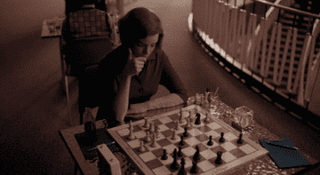

# Projeto para elaborar um jogo de xadrez  :chess_pawn:

O projeto será dividido em três etapas básicas, criação do **tabuleiro**, **mecânica geral** e **jogadas especiais**.

Cada etapa do projeto será documentanda e versionada aqui!

Ao final, será entregue uma interface com uma jogabilidade real de uma partida de xadrez, com elementos gráficos, mesmo que de maneira básica, assim como a implementação de todas as suas regras e movimentos.

# Atualização

Com o projeto finalizado houve uma grande utilização de conceitos de Orientação a Objeto, como encapsulamento, herança, polimorfismo, associações e composições, assim como outros conceitos consolidando o conhecimento adquirido até aqui. Durante o projeto também ficou claro como funciona o comportamento de cada classe e a importância de alinhar seus métodos, para estabelecer uma relação coesa entre as mesmas. Também ficou mais claro o papel de cada classe, facilitando a delegação de tarefas e divisão no prórprio projeto, colaborando para uma arquitetura de código mais clara e precisa.

  

